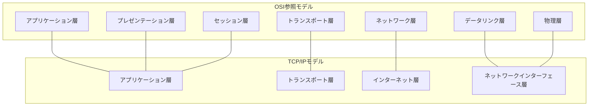

# インターネットの構造とレイヤー

本資料では、インターネットに関する主要な用語や概念を、例や個別の詳細説明を極力省き、構造・レイヤー・関係性を中心に図でまとめる。

## 1. インターネットのレイヤー構造

#### OSI参照モデルとTCP/IPモデルの違い（理論と実務のニュアンス）
OSI参照モデルは「理論的な標準モデル」であり、ネットワーク通信の機能を7層に分けて整理・定義するための枠組み（主に概念整理・教育・設計指針として利用）。
一方、TCP/IPモデルは「実際のインターネットプロトコル体系」を4層で表現したもので、現実のネットワーク（インターネット）で広く使われている実装基準。

まとめ：OSI参照モデルは「理論・整理・教育用」、TCP/IPモデルは「実際のネットワーク実装・運用用」として分けて考えられている。

### OSI参照モデルとTCP/IPモデルの対応

---

### プロトコル階層化の理由（OSI参照モデル・TCP/IPモデル）

OSI参照モデルやTCP/IPモデルでプロトコルを階層化する主な理由は次の2点です。

1. 1つのプロトコルで全機能を定義しようとすると複雑になりすぎるため、階層ごとに役割を分担して設計・管理しやすくするため。
2. 階層ごとに分割することで、特定の階層だけを差し替えたり、機能追加・変更を容易にできるため（柔軟性・拡張性の向上）。

この2点が、OSI参照モデルやTCP/IPモデルでプロトコルを階層化する主な理由です。

### 各層の役割

---

### IPとTCPの役割・特徴

---

### コネクション指向型とは

コネクション指向型とは、「通信を始める前に、送信側と受信側の間で接続（コネクション）を確立し、その後データのやりとりを行う方式」です。

TCPはコネクション指向型の代表例で、通信開始時に「接続確立（3ウェイハンドシェイク）」を行い、データの順序保証・再送制御・誤り検出など、信頼性の高い通信を実現します。

一方、UDPはコネクションレス型（接続確立不要）です。

- **IP（Internet Protocol）**は、TCP/IPモデルの「インターネット層」を担い、複数のネットワーク間で相互に通信できる仕組み（ネットワーク間の中継・経路制御）を提供します。
- **TCP（Transmission Control Protocol）**は、「トランスポート層」を担うプロトコルで、コネクション指向型・信頼性重視の通信（データの順序保証・再送制御・誤り検出など）を実現します。

このように、IPはネットワーク間の通信を、TCPは信頼性の高いデータ転送をそれぞれ担当しています。

---

### イーサネットの物理媒体とその種類

イーサネットで使われる物理的なケーブルには大きく分けて「メタルケーブル」と「光ファイバケーブル」があります。

#### 光回線は有線回線の代表例

「光回線（光ファイバ回線）」は、有線回線の代表的な例です。物理的な光ファイバケーブルを使ってデータを伝送するため、「無線」ではなく「有線」に分類されます。

#### 有線区間と無線区間の違い（光回線の場合）
#### ISPサービスとアクセス回線サービスが分かれている理由
インターネット接続には「ISP（インターネットサービスプロバイダ）」と「アクセス回線（物理回線）サービス」の2つの役割があります。

これが分かれている主な理由は次の通りです。
- **役割分担**：
  - アクセス回線事業者（NTTなど）は、物理的な回線（光ファイバやメタル線など）を敷設・維持管理します。
  - ISPは、インターネットへの接続サービス（IPアドレスの割り当て、認証、トラフィック管理など）を提供します。
- **競争促進・選択肢の多様化**：
  - 回線とISPを分離することで、ユーザーは好きなISPを選べるようになり、サービスや料金の競争が生まれます。
  - 例えば「フレッツ光（NTT東西）」の回線を使いながら、複数のISPから選択できる仕組みです。

この分離により、インフラの効率的な利用とサービスの多様化が実現されています。

#### NATとNAPTの違い
NAT（Network Address Translation）とNAPT（Network Address and Port Translation）は、どちらもプライベートIPアドレスとグローバルIPアドレスの変換技術ですが、変換の範囲が異なります。

- **NAT**：
  - IPアドレスのみを変換する方式。
  - 1対1変換が基本（例：1つのプライベートIP ⇔ 1つのグローバルIP）。
- **NAPT**（IPマスカレードとも呼ばれる）：
  - IPアドレスとポート番号の両方を変換する方式。
  - 1つのグローバルIPアドレスで複数の端末（複数のプライベートIP）を同時にインターネット接続できる。
  - 家庭用ルーターなどで一般的。
  - **複数端末が同じグローバルIPアドレスを共有し、ポート番号をずらすことで区別して通信できる。**

まとめ：
NATは「IPアドレスのみ変換」、NAPTは「IPアドレス＋ポート番号を変換」し、より多くの端末が同時に通信できる仕組みです。

また、NAPTでは複数の端末が同じグローバルIPアドレスを共有し、ポート番号をずらすことで区別して通信できます。  
この内容は教科書

一般的な家庭用インターネットでは、
- 電話局（局舎）〜ONU（光回線終端装置）までは「光ファイバケーブル」による有線接続です。
- ONUから先（ルーター〜端末）は、LANケーブルによる有線接続も、Wi-Fiなどの無線接続も選択できます。
つまり「光回線＝すべて有線」ではなく、ONU以降は有線・無線どちらもあり得ます。

無線回線の代表例は「Wi-Fi」や「携帯電話の電波（4G/5G）」などです。

- **メタルケーブル**
  - 「平衡対ケーブル（ツイストペアケーブル）」と「同軸ケーブル」がある
  - 現在は取り扱いがしやすい「平衡対ケーブル」が主流
- **光ファイバケーブル**
  - 「シングルモードファイバ」と「マルチモードファイバ」がある
  - 用途や伝送距離に応じて使い分けられる

このように、イーサネットの物理媒体には複数の種類があり、用途や設置環境に応じて選択されている。

---

### TCPとUDPの違い（トランスポート層の主要プロトコル）

| プロトコル | 主な特徴 | 信頼性 | コネクション | データ転送方式 |
|:---|:---|:---|:---|:---|
| **TCP** | データの信頼性・順序性を保証 | あり（再送・順序制御・誤り検出） | コネクション型 | ストリーム（連続的） |
| **UDP** | 軽量・高速、信頼性保証なし | なし（再送・順序制御なし） | コネクションレス型 | データグラム（個別単位） |

TCPは信頼性重視、UDPは速度・シンプルさ重視という構造的な違いがある。

---

#### プログラミング上の違い（通信開始確認の有無）
コネクション指向型（TCP）では、`socket()`でソケットを作成した後、`connect()`で通信相手との接続確立（通信開始の確認）を行い、その後`send()`でデータ送信を行う。
コネクションレス型（UDP）では、`socket()`でソケットを作成したら、すぐに`sendto()`で通信相手にデータを送信できる（通信開始の確認は不要）。

このように、通信開始の確認（接続確立）の有無が、TCPとUDPの大きな違いの一つとなっている。

---

### 通信方式の3分類
- **ユニキャスト（Unicast）**: 1対1の通信方式。1つの送信元から1つの宛先へデータを送信。
- **ブロードキャスト（Broadcast）**: 1対全体の通信方式。1つの送信元から同一ネットワーク内の全ての宛先へデータを送信。
- **マルチキャスト（Multicast）**: 1対多の通信方式。1つの送信元から特定のグループに属する複数の宛先へデータを送信。

アドレス指定の違い：

---

### ブロードキャストアドレスが存在するレイヤー

ブロードキャストアドレスは、OSI参照モデルの「データリンク層」と「ネットワーク層」の両方に存在します。

- データリンク層：MACアドレスのブロードキャスト（FF:FF:FF:FF:FF:FF）
- ネットワーク層：IPv4アドレスのブロードキャスト（例：192.168.1.255）

どちらも「同一ネットワーク内の全端末宛て」に使われます。

### スター型とリング型の違い・中心装置の有無について

スター型は、各端末がハブ（またはスイッチ）に直接接続される「集中型」のトポロジです。ハブやスイッチが中心となり、全端末がそこに集まります。

一方、リング型は各端末が隣の端末とだけ接続され、全体で輪（リング）を構成する「分散型」のトポロジです。中心となる装置は存在せず、端末同士が直接つながります。

このため、スター型の「スイッチ（ハブ）」に相当するものはリング型にはありません。

また、スター型はハブやスイッチの故障が致命的ですが、リング型は端末の故障が全体に影響しやすいという違いもあります。

### IPconfigとは
### MACアドレスの長さと理由

MACアドレスは基本的に「6バイト（48ビット）」で構成されています。

これは「世界中の全ネットワーク機器に一意なアドレスを割り当てるため」に決められました。
48ビットあれば2の48乗（約2.8兆）通りのアドレスが作れ、将来の機器増加も見越して十分な数となっています。
1970年代のイーサネット標準化時に「一意性の確保」と「拡張性」を両立するために6バイトとされました。
IPアドレスやサブネットマスク、デフォルトゲートウェイ、MACアドレスなど、ネットワークインターフェースの設定情報を表示・確認するためのCLI（コマンドラインインターフェース）コマンド（主にWindowsで利用）。
ネットワークのトラブルシューティングや設定確認に用いられる。

### nslookupとは
`nslookup`は、DNS（ドメインネームシステム）サーバに問い合わせを行い、ドメイン名からIPアドレスを、またはIPアドレスからドメイン名を調べるためのCLIコマンド。
ネットワークの名前解決の確認やDNSの動作検証に用いられる。

---

## 2. レイヤー間の主な用語・構造

（今後、各レイヤーごとに主要な用語やプロトコル、構造の関係図を追加していく）

### CSMA/CD（Carrier Sense Multiple Access with Collision Detection）とは

CSMA/CDは、主にバス型トポロジのイーサネットで使われていたアクセス制御方式です。  
「Carrier Sense Multiple Access with Collision Detection（キャリア検知多重アクセス／衝突検出）」の略です。

- 端末はまず「キャリアセンス（通信路が空いているか確認）」を行い、空いていれば送信を開始します。
- 複数の端末が同時に送信して衝突（コリジョン）が発生した場合、両方の端末は通信を一旦中断し、ランダムな待ち時間（バックオフ）を設けてから再送信を試みます。

この仕組みにより、複数端末が同じ通信路を効率よく共有できます。

### IPv6パケットの先頭4ビットについて

IPv6パケットの最初の4ビットは「バージョン番号」を示しており、値は常に`0110`（2進数、10進数で6）で固定されています。  
この4ビットによって「このパケットがIPv6である」ことが識別されます。  
（参考：IPv4の場合

---

### ドメインの正引きと逆引き

- **正引き（forward lookup）**：ドメイン名（例：www.example.com）からIPアドレス（例：93.184.216.34）を調べること。Webアクセスやメール送信時など、一般的な名前解決はこちら。
- **逆引き（reverse lookup）**：IPアドレス（例：93.184.216.34）からドメイン名（例：www.example.com）を調べること。ログ解析やメールサーバの認証などで使われる。

まとめ：  
正引き＝ドメイン名→IPアドレス、逆引き＝IPアドレス→ドメイン名

---

### 情報セキュリティの3要素（CIA）

- **機密性（Confidentiality）**：認められた人だけが情報にアクセスできる特性。
- **完全性（Integrity）**：情報が矛盾なく、改ざんや破壊がないことを保証する特性。
- **可用性（Availability）**：必要な時に中断なく情報やサービスを利用できる特性。

この3つが情報セキュリティの基本的な柱

---

### 情報セキュリティに関する主な攻撃手法

- **ゼロデイ攻撃（Zero-day attack）**  
  ソフトウェアやOSなどの脆弱性が開発者や利用者に知られる前に、その脆弱性を悪用して行われる攻撃。修正パッチが提供される前に攻撃されるため、被害が大きくなりやすい。

- **フィッシング（Phishing）**  
  偽のWebサイトやメールを使って、ユーザーからパスワードやクレジットカード番号などの個人情報をだまし取る攻撃。

- **マルウェア（Malware）**  
  コンピュータウイルス、ワーム、トロイの木馬など、悪意のあるソフトウェア全般。感染や情報漏洩、システム破壊などを引き起こす。

- **DoS攻撃／DDoS攻撃（Denial of Service / Distributed Denial of Service）**  
  サーバやネットワークに大量のリクエストを送りつけ、サービスを利用不能にする攻撃。DDoSは複数の端末から同時に攻撃する。

- **パスワードクラック**  
  総当たり（ブルートフォース）や辞書攻撃などでパスワードを推測・解析し、不正アクセスを試みる攻撃。

- **SQLインジェクション**  
  Webアプリケーションの入力欄などから不正なSQL文を注入し、データベースを不正操作する攻撃。

- **クロスサイトスクリプティング（XSS）**  
  Webサイトに悪意のあるスクリプトを埋め込み、利用者のブラウザ上で実行させる攻撃。Cookieの盗難や偽フォーム表示などに使われる。

---

### 暗号方式の種類と鍵配送の課題

- **共通鍵暗号方式（対称鍵暗号方式）**  
  暗号化と復号に同じ鍵（共通鍵）を使う方式。  
  問題点は「共通鍵を安全に相手（復号する人）に届ける方法」が難しいこと。鍵配送の安全性が課題となる。

- **公開鍵暗号方式（非対称鍵暗号方式）**  
  暗号文を受け取る側が「秘密鍵」と「公開鍵」を作成し、公開鍵を暗号化する側に渡す。  
  送信者は公開鍵で暗号化し、受信者は秘密鍵で復号する。  
  これにより、安全に暗号文の送付と復号が可能となる。

---

### ディジタル変調方式：PSK（Phase Shift Keying）

- **PSK（位相偏移変調）**は、ディジタルデータ（0と1）に応じて搬送波の位相を変化させる変調方式です。
- 0と1のビット情報を、搬送波の位相の違いとして表現し、無線や有線の通信路で効率よく伝送するために使われます。
- PSKはノイズに強く、効率的なディジタル通信を実現できるため、無線LANや衛星通信、各種デジタル通信で広く利用されています。

---

### MIMO（Multiple Input Multiple Output）とは

- **MIMO（マイモ、Multiple Input Multiple Output）**は、無線通信で複数のアンテナを送信側・受信側の両方に用いる技術です。
- これにより、同時に複数のデータストリームを送受信でき、通信速度の向上や通信の安定化（耐干渉性の向上）が実現されます。
- Wi-Fi（IEEE 802.11n/ac/ax）やLTE、5Gなどの無線通信規格で広く利用されています。
- MIMOは、空間多重化やビームフォーミングなどの技術と組み合わせて、限られた周波数帯域での通信効率を大幅に高める役割を持ちます。

---

### ARP（Address Resolution Protocol）とは

ARPはネットワークインターフェース層（OSI参照モデルではデータリンク層）で動作するプロトコルで、  
相手コンピュータのIPアドレスからMACアドレスを取得するために使われます。  
これにより、IP通信を物理的なネットワーク（イーサネットなど）上で実行するための情報を得ることができます。

ARPは、IPアドレスとMACアドレスの対応関係を管理することで、ネットワーク上のデータ転送を可能にします。

ARPは、IPアドレスからMACアドレスを知りたいとき、まずブロードキャストで「このIPアドレスの人は誰ですか？」とネットワーク全体に呼びかけます。  
該当するIPアドレスを持つ機器だけが、ユニキャストで自分のMACアドレスを返送します。

この仕組みにより、IPアドレスとMACアドレスの対応関係を動的に学習・更新しながら、ネットワーク上でのデータ転送が実現されます。

---

### IPアドレスのネットワーク部とホスト部の見分け方・ネットワーク分割

IPアドレスが同じネットワークにつながっているかどうかは、サブネットマスク（例：/24など）を使って「ネットワーク部」が一致しているかを見ます。  
ホスト部は機器ごとに異なり、ネットワーク部が同じなら同じネットワークに属します。

IPv4では、昔は上位8ビット（最初の1オクテット）で「クラスA/B/C」などの識別をしていましたが、現在はCIDR表記（例：192.168.1.0/24）でネットワーク部とホスト部を柔軟に分割します。  
IPv6では、アドレスの先頭部分（プレフィックス）で種類や用途を識別します。

ネットワークの分割数は、サブネットマスク（/表記）で決まり、  
「分割後のネットワーク部のビット数 − 元のネットワーク部のビット数」の差分だけ2の乗数で分割できます。

例：  
- クラスC（元は/24）を/26で分割 → 26-24=2 → 2^2=4通り（4つのサブネットに分割）

---

### MSS（Maximum Segment Size）とMTU（Maximum Transmission Unit）

- **MSS（Maximum Segment Size）**  
  TCPで一度に送信できるアプリケーションデータの最大サイズ。  
  TCPヘッダ（通常20バイト）とIPヘッダ（通常20バイト）を除いた、純粋なデータ部分の最大値。

- **MTU（Maximum Transmission Unit）**  
  ネットワーク層で一度に送信できる最大パケットサイズ（イーサネットの場合は通常1500バイト）。  
  IPヘッダ＋TCPヘッダ＋MSSの合計がMTU以下になるように分割される。

- 通信の流れ：  
  アプリケーションメッセージはまずMSS単位で切り出され、TCPヘッダ・IPヘッダが付加されてMTUサイズのパケットとなり、さらにイーサネットヘッダが付加されて送信される。  
  受信側では、イーサネットヘッダ→IPヘッダ→TCPヘッダの順に外してデータを取り出す。

- ルータは、イーサネットヘッダとIPヘッダまでしか操作せず、TCPヘッダやアプリケーションデータには触れない。

---

### イーサネットとは

イーサネットは、有線LAN（ローカルエリアネットワーク）の標準規格であり、物理層とデータリンク層で動作します。  
複数の機器をケーブルで接続し、高速かつ安定した通信を実現するために世界中で広く使われています。

イーサネットの物理媒体には、メタルケーブル（ツイストペアケーブルや同軸ケーブル）、光ファイバケーブルなどがあり、設置環境や用途に応じて選択されます。

ネットワークインターフェースカード（NIC）は、イーサネット通信を行うための機器であり、各NICには固有のMACアドレスが書き込まれています。  
このMACアドレスは**6バイト（48ビット）**で構成されており、世界中の機器で一意となるように設計されています。  
MACアドレスを使って、イーサネット上で機器同士の通信相手を識別します。

イーサネットは、物理的な接続方式としてだけでなく、データリンク層での通信制御やフレーム構造も規定しており、LANの基本となる技術です。
